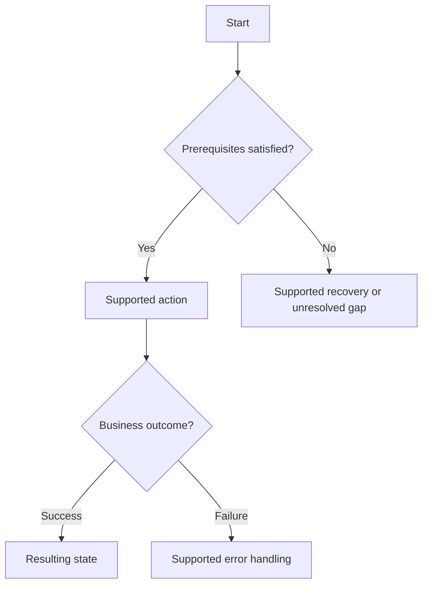
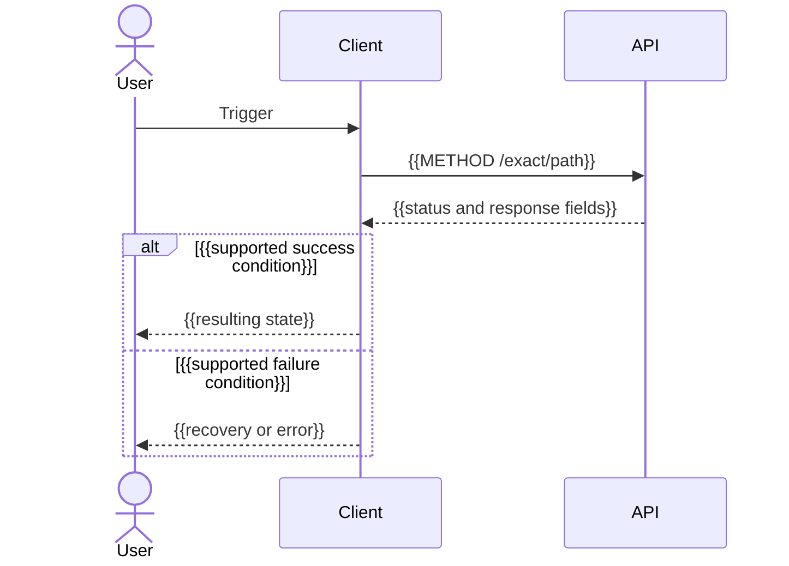

# {{Feature or flow title}}

> Translate headings/prose into the selected language. Keep all diagram labels, participants, messages, notes, and conditions in English; preserve exact contract literals. Replace tokens and remove irrelevant sections. Diagram placeholders are authoring guidance, not verified behavior. Never place diagrams back-to-back without explaining the preceding flow.

Platform: {{Mobile or Web}}  
Audience: {{receiving team}}  
Evidence: {{source-inspected / runtime-verified / proposed; revision if available}}

## Goal and prerequisites

{{Actor, trigger, auth/context/permissions, entry and final states. Feature entry points explain scope and link complete flow files.}}

## Overall flow



## Flow explanation

{{In the selected language, explain the trigger, steps, each decision branch, resulting states, and recovery. Replace diagram decisions with actual behavior. For multiple flows, repeat complete sections or link complete flow files.}}

## API sequence



## Ordered API calls

{{In the selected language, explain why calls occur in this order, which are conditional, and which response fields supply the next request.}}

| Step | Trigger / condition | Method and path | Input and value origin | Response used next |
| --- | --- | --- | --- | --- |
| {{1}} | {{trigger}} | {{METHOD /path}} | {{field from selection or earlier response.field}} | {{field used by next request or UI}} |

## Contract examples

### {{METHOD /path — endpoint purpose}}

{{Verified authentication/context headers, encoding, required/optional fields, and source links. Repeat per endpoint.}}

#### {{Case name: success / alternative outcome / supported error}}

Condition: {{Input or state that triggers this case. Repeat for every integration-relevant case supported by source.}}

Request body:

```json
{{Valid illustrative JSON matching this case's contract}}
```

{{For bodyless requests, replace the block with an explicit no-body statement and relevant path/query/header inputs. For multipart, show actual parts instead of JSON. Cases sharing the same request may link to that request explicitly.}}

HTTP status: {{Actual status}}

Response body:

```json
{{Valid illustrative JSON with the actual envelope and case-specific fields}}
```

{{For empty responses, replace the block with an explicit no-body statement. Unknown shapes are unresolved gaps, not invented examples.}}

Client action: {{Explain the business outcome, fields consumed next, and implemented or suggested recovery in the selected language.}}

## Outcomes and recovery

| Condition / actual error | Business state | Client action | Evidence |
| --- | --- | --- | --- |
| {{condition}} | {{state}} | {{implemented or suggested action}} | {{source link or unresolved}} |

## Sources and verification

{{Relative links to contracts, routes, business rules, and client consumers; checks actually performed and unresolved discrepancies.}}
