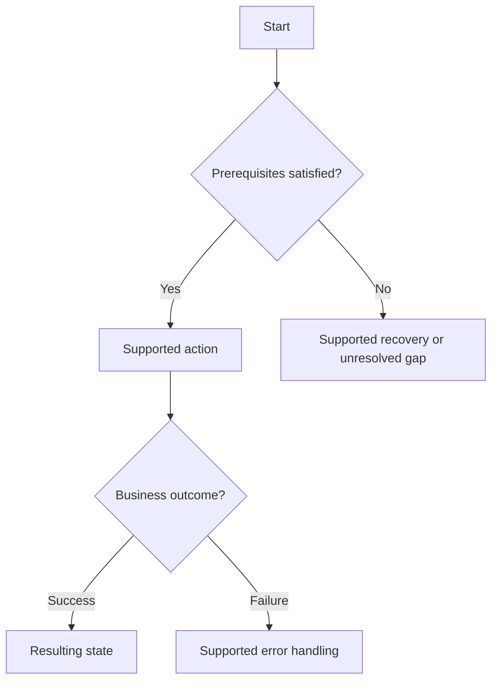
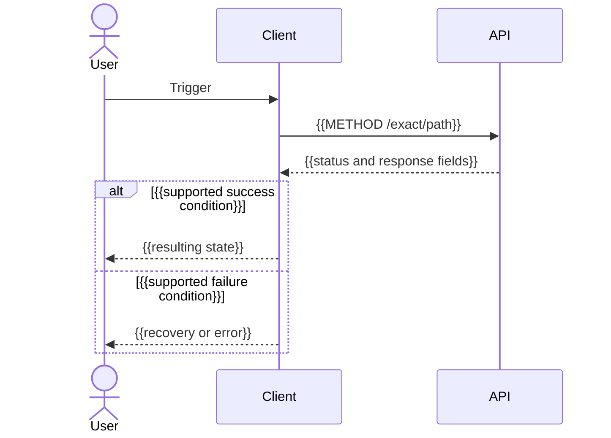

# {{Feature or flow title}}

> Translate headings/prose into the selected language, replace tokens, and remove irrelevant sections. Diagram placeholders are authoring guidance, not verified behavior.

Platform: {{Mobile or Web}}  
Audience: {{receiving team}}  
Evidence: {{source-inspected / runtime-verified / proposed; revision if available}}

## Goal and prerequisites

{{Actor, trigger, auth/context/permissions, entry and final states. Feature entry points explain scope and link complete flow files.}}

## Overall flow

{{Replace decisions with actual behavior. Repeat diagrams and API sections for each covered flow or link complete flow files.}}

## API sequence

## Ordered API calls

| Step | Trigger / condition | Method and path | Input and value origin | Response used next |
| --- | --- | --- | --- | --- |
| {{1}} | {{trigger}} | {{METHOD /path}} | {{field from selection or earlier response.field}} | {{field used by next request or UI}} |

## Contract examples

{{Verified headers/context, path/query/body, encoding, required/optional fields, response envelope, and illustrative payloads.}}

## Outcomes and recovery

| Condition / actual error | Business state | Client action | Evidence |
| --- | --- | --- | --- |
| {{condition}} | {{state}} | {{implemented or suggested action}} | {{source link or unresolved}} |

## Sources and verification

{{Relative links to contracts, routes, business rules, and client consumers; checks actually performed and unresolved discrepancies.}}
